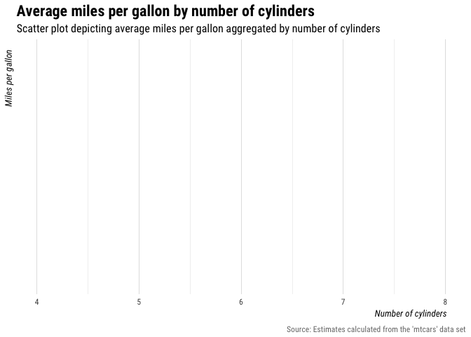
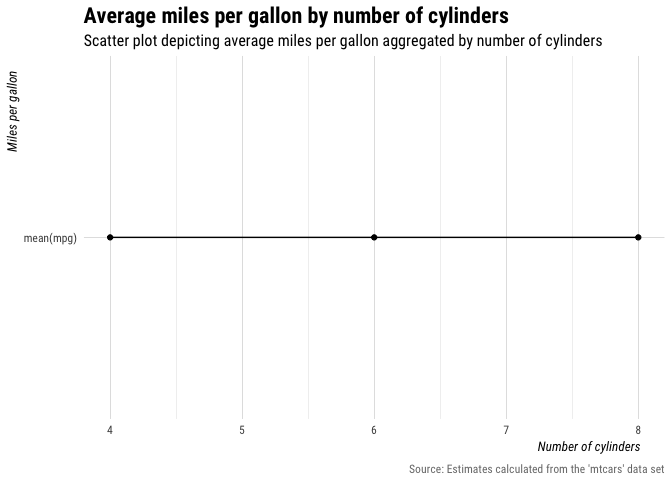
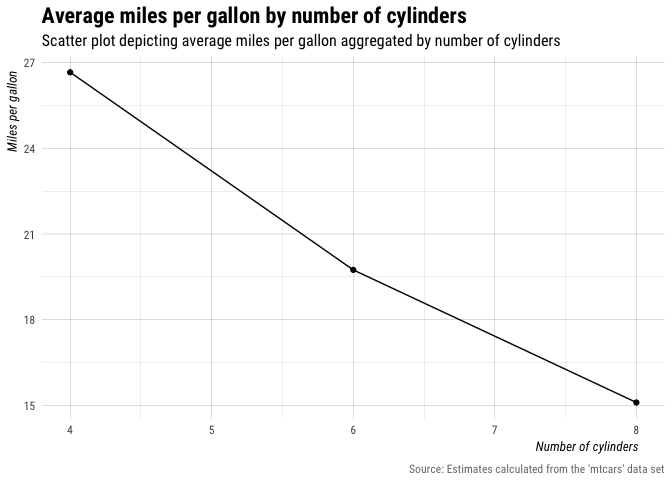

This tutorial identifies **three common mistakes users make when attempting to 
map variables** from [`dplyr::summarize()`](https://dplyr.tidyverse.org/reference/summarise.html) 
to aesthetic dimensions of a plot with [ggplot2](https://ggplot2.tidyverse.org).
It concludes by describing the solution to these common mistakes.

## Packages/styles

To complete this tutorial, you will need to load the [tidyverse](https://tidyverse.org) 
set of packages and define a couple stylistic functions used throughout to make 
the [#dataviz](https://twitter.com/search?q=%23rstats%20%23dataviz&src=typed_query&f=image) a little prettier.


```r
## load tidyverse
library(tidyverse)
#> ── Attaching packages ─────────────────────────────────────────────────────────── tidyverse 1.2.1 ──
#> ✔ ggplot2 3.0.0.9000     ✔ purrr   0.2.5     
#> ✔ tibble  1.4.2          ✔ dplyr   0.7.6     
#> ✔ tidyr   0.8.1          ✔ stringr 1.3.1     
#> ✔ readr   1.1.1          ✔ forcats 0.3.0
#> ── Conflicts ────────────────────────────────────────────────────────────── tidyverse_conflicts() ──
#> ✖ dplyr::filter() masks stats::filter()
#> ✖ dplyr::lag()    masks stats::lag()

## create style theme
my_theme <- function() {
  theme_minimal(base_family = "Roboto Condensed") + 
    theme(plot.title = element_text(size = rel(1.5), face = "bold"), 
      plot.subtitle = element_text(size = rel(1.1)),
      plot.caption = element_text(color = "#777777", vjust = 0),
      axis.title = element_text(size = rel(.9), hjust = 0.95, face = "italic"),
      panel.grid.major = element_line(size = rel(.1), color = "#000000"), 
      panel.grid.minor = element_line(size = rel(.05), color = "#000000"))
}
my_labs <- function() {
  labs(title = "Average miles per gallon by number of cylinders", 
    subtitle = "Scatter plot depicting average miles per gallon aggregated by number of cylinders",
    x = "Number of cylinders", y = "Miles per gallon",
    caption = "Source: Estimates calculated from the 'mtcars' data set")
}
```


## Data

The examples below use the **mtcars** data from the [datasets](https://stat.ethz.ch/R-manual/R-devel/library/datasets/html/mtcars.html) 
package. Specifically, the examples below will feature the `mpg` (miles per gallon) 
and `cyl` (number of cylinders) variables.


```r
## print first six rows
head(mtcars)
```

<div class="kable-table">

                      mpg   cyl   disp    hp   drat      wt    qsec   vs   am   gear   carb
------------------  -----  ----  -----  ----  -----  ------  ------  ---  ---  -----  -----
Mazda RX4            21.0     6    160   110   3.90   2.620   16.46    0    1      4      4
Mazda RX4 Wag        21.0     6    160   110   3.90   2.875   17.02    0    1      4      4
Datsun 710           22.8     4    108    93   3.85   2.320   18.61    1    1      4      1
Hornet 4 Drive       21.4     6    258   110   3.08   3.215   19.44    1    0      3      1
Hornet Sportabout    18.7     8    360   175   3.15   3.440   17.02    0    0      3      2
Valiant              18.1     6    225   105   2.76   3.460   20.22    1    0      3      1

</div>

### Names from `summarize()`

A popular workflow in R uses [dplyr](https://dplyr.tidyverse.org) to `group_by()`
and then `summarise()`<sup>1</sup> variables. 
It's an intuitive and easy way to aggregate and describe data, especially along 
multiple dimensions. The cost of being both powerful and user-friendly, 
however, is its arguably inconvenient default method for assigning names to 
summarized values. As the code illustrates below, users can provide their own 
names when using `summarize()`.


```r
## explicitly named summarize variable
mtcars %>%
  group_by(cyl) %>%
  summarize(mpg = mean(mpg))
```

<div class="kable-table">

 cyl       mpg
----  --------
   4   26.6636
   6   19.7429
   8   15.1000

</div>

But when users don't explicitly name the summarized values, instead of inheriting 
the name of the summarized variable (in this case, `mpg`), they are named with 
the expression used to calculate it.


```r
## unnamed summarize variable
mtcars %>%
  group_by(cyl) %>%
  summarize(mean(mpg))
```

<div class="kable-table">

 cyl   mean(mpg)
----  ----------
   4     26.6636
   6     19.7429
   8     15.1000

</div>

As you can see above, the variable name `mean(mpg)` in the unnamed summarize 
output is different than the simpler and cleaner name `mpg` in the explicitly 
names summarize output.

This may seem a bit obnoxious at first, but it makes a lot of sense when you 
think about instances when you may want to use **two or more** variables when 
calculating `summarize()` values.

Regardless, while it's probably better practice to provide your own summary 
variable names, you will invariably find yourself in a situation where you are 
trying to plot variables that were named using the expressions used to create 
them.

## Mapping incorrect names

When visualizing data with [ggplot2](https://ggplot2.tidyverse.org), one of the 
first and most important steps entails mapping observed variables in the data 
set to aesthetic dimensions of a plot. But aesthetic mapping will only work as 
expected when you provide the correct names via `ggplot2::aes()`.

The following section describes three common mistakes users make that result in 
the mapping of incorrect names.

### 1. Assuming a statistic inherits the name of a variable.

A common mistake is to assume that summarizing via `mean()` or `median()` 
results in a variable with the same name. For example, if we summarize the mean 
of `mpg` like we did above, i.e., `summarize(mean(mpg))`, and then try to map 
`y = mpg`, we get an error because "mpg" doesn't exist.


```r
## this gets an error because there is no variable named "mpg"
mtcars %>%
  group_by(cyl) %>%
  summarize(mean(mpg)) %>%
  ggplot(aes(x = cyl, y = mpg)) + 
  geom_point() + 
  geom_line() + 
  my_theme() + 
  my_labs()
Error: Aesthetics must be either length 1 or the same as the data (3): x, y
```

We know from the **summarize** section above the variable's name is actually 
`mean(mpg)`. As this example illustrates, it is incorrect to assume that
summarized estimates inherit the name of the variable they summarize. This may 
seem annoying at first, but it makes sense when you think about times when you 
may want to summarize using **two or more variables** in the data set.


### 2. Repeating the expression used in `summarize()`.

A second common mistake is to assume that you can simply repeat the expression 
used in `summarize()` when specifying aesthetic mappings.


```r
## this also doesn't work because it tries to caculate the mean of mpg
mtcars %>%
  group_by(cyl) %>%
  summarize(mean(mpg)) %>%
  ggplot(aes(x = cyl, y = mean(mpg))) + 
  geom_point() + 
  geom_line() + 
  my_theme() + 
  my_labs()
#> Warning in mean.default(mpg): argument is not numeric or logical: returning
#> NA

#> Warning in mean.default(mpg): argument is not numeric or logical: returning
#> NA

#> Warning in mean.default(mpg): argument is not numeric or logical: returning
#> NA
#> Warning: Removed 3 rows containing missing values (geom_point).
#> Warning: Removed 3 rows containing missing values (geom_path).
```



The result is a handful of warnings and an empty plot. The above code fails 
because it tries to calculate mean of `mpg`, which, again, doesn't exist in the 
summarized data.

### 3. Passing the expression name as a string.

The third common mistake is to treat the summarized expression name as a string.


```r
## if we put quotes around it, it assumes it's a string
mtcars %>%
  group_by(cyl) %>%
  summarize(mean(mpg)) %>%
  ggplot(aes(x = cyl, y = "mean(mpg)")) + 
  geom_point() + 
  geom_line() + 
  my_theme() + 
  my_labs()
```



This time we get a plot and no warnings, but it's clearly not right. It shows 
every `y` value is exactly the same, but it seems far fetched to think the 
average miles per gallon would not vary with number of cylinders.


In this case, the literal string `"mean(mpg)"` is mapped to the `y` variable 
value, which means it's converted to a factor and the single factor level is 
coded as `1` at each observation.


### Solution: use tick marks

At this point it should be clear the name of the summarized `mpg` variable is 
actually "mean(mpg)," only now we also know wrapping the expression with quotes 
doesn't work because it assumes the expression is a literal string, not a 
variable name.

The solution to correctly mapping unnamed `summarize()` variables is to use 
tick marks--the apostrophe-like symbol at the top-left of your keyboard. Tick
marks work a lot like quotes insofar as they open and close and wrap all 
elements into a single object. The difference is tick marks assume the marked 
object references a symbol. To illustrate, the code below assigns 10 random 
numbers to `x` and then prints it using both ticks and quotes.


```r
## assign 10 random numbers to x
x <- rnorm(10)

## print x wrapped in quotes
"x"
#> [1] "x"

## print x wrapped in tick marks
`x`
#>  [1]  1.500933 -0.374477  0.584313 -1.896013 -0.099927 -0.448693  0.173796
#>  [8]  1.399240 -0.483059 -1.387695
```

So, really, tick marks are used to distinguish symbols that contain one or more
unfriendly punctuation/characters, e.g., parenthesis, dashes, spaces, etc.

With this knowledge, we can now fix the featured `summarize()` example by 
wrapping the summarized expression, which functions as the name of the 
summarized variable, in tick marks.


```r
## if we put quotes around it, aes() assumes we are entering a string
mtcars %>%
  group_by(cyl) %>%
  summarize(mean(mpg)) %>%
  ggplot(aes(x = cyl, y = `mean(mpg)`)) + 
  geom_point() + 
  geom_line() + 
  my_theme() + 
  my_labs()
```




## Notes

<sup>1</sup> The `s` and `z` toward the end of `summarise()` and `summarize()` 
are interchangeable.


<style>
.author em {
font-style: normal;
color: #33333388;
text-align: center;
display: block;
font-size: .95em;
padding-top: 20px;
font-weight: 400;
} 
.citation {
font-style: normal;
font-size: .8em;
}
.date {
padding-bottom: 20px;
}
img {
display: block;
margin: auto;
}
.table {
width: unset;
min-width: 30%
}
</style>
