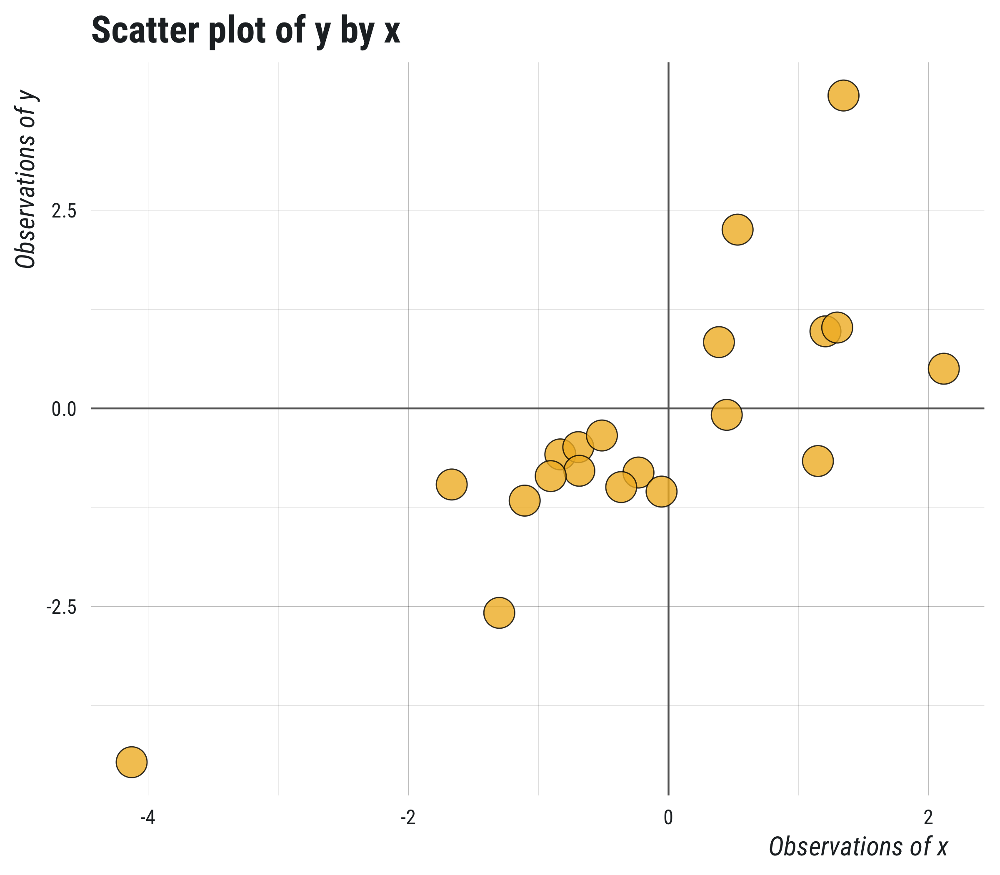
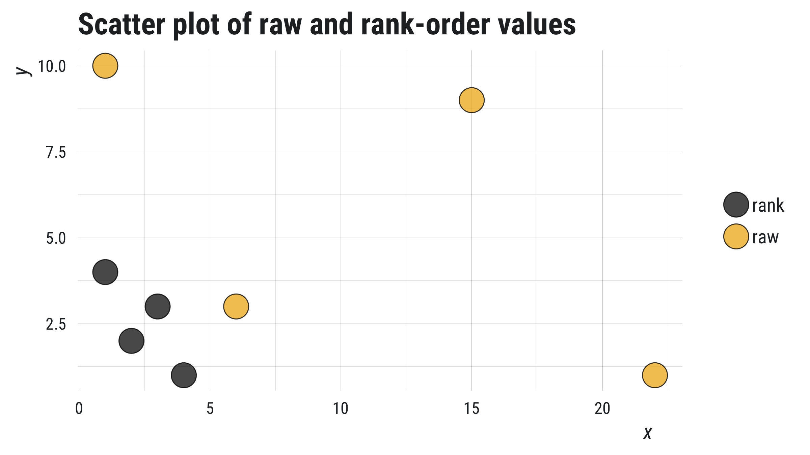

class: inverse, center, middle

```{r setup, include=FALSE}
knitr::opts_chunk$set(echo = TRUE, eval = TRUE, collapse = TRUE, comment = "#>")
options(htmltools.dir.version = FALSE)
htmltools::tagList(rmarkdown::html_dependency_font_awesome())

## load libraries, set ggplot2 theme, and create datatable function
library(tidyverse)
theme_set(tfse::theme_mwk(base_size = 18))
set.seed(20180911)
print <- function(x, n = NULL, align = "c", digits = 3) {
  if (is.null(n)) n <- nrow(x)
  if (nrow(x) < n) n <- nrow(x)
  cat(paste(knitr::kable(x[seq_len(n), ], format = "markdown", 
    align = align, digits = digits), collapse = "\n"))
}
```

## Agenda

---

## Agenda
1. Co-variance
   - What is covariance?
   - Calculating covariance
1. Correlations
   - Bivariate correlations
   - Correlation matrices
1. Factor analysis
   - What is a factor?
   - Calculating scores
   - Reliability
---
class: inverse, center, middle

## Co-variance

---

## Variation (review)

**Variance**: average distance from the mean

$$s^2=\frac{\sum (x - \bar{x})^2}{n - 1}$$

+ Single variable: $x$
+ Always positive: $(x - \bar{x})^2$


---

## Co-variation

**Covariance**: average *related* distance**s** from the mean

$$cov_{(x, y)} = \frac{\sum (x-\bar{x})(y-\bar{y})}{n - 1}$$

+ Two variables: $x$ and $y$
+ Can be positive or negative
   - Positive means vary [above/below mean] together
   - Negative means vary [above/below mean] inversely

---

## Note:

When a variable covaries with itself...

$$cov_{(x, x)} = \frac{\sum (x-\bar{x})(x-\bar{x})}{n - 1}$$

$$cov_{(x, x)} = \frac{\sum (x - \bar{x})^2}{n - 1}$$

$$cov_{(x, x)} = s^2$$

> Covariance with self is the same as variance

---

## Correlation

A **correlation** describes how variation in one variable relates to variation in another variable. 

In statistics, correlations describe the **magnitude** and **direction** of a relationship between two variables. 

---

## Example code...

```{r, fig.show = 'hide', fig.keep = 'none'}
## create data frame with x and y coming from random normal draws
df <- data_frame(x = rnorm(20), y = x + rnorm(20))

## plot points
ggplot(df, aes(x, y)) + 
  geom_vline(xintercept = 0, color = "#666666") + 
  geom_hline(yintercept = 0, color = "#666666") + 
  geom_point(shape = 21, fill = "#F1B82D", size = 8, alpha = .8) + 
  labs(title = "Scatter plot of y by x", 
    x = "Observations of x", y = "Observations of y") + 
  ggsave("img/scatter_plot.png", width = 8, height = 7, units = "in")
```

---

<p style="align:center">  </p>

---

## Correlation coef

**`r`**: statistic that describes the magnitude (size) and direction (order) of a relationship

There are several types of correlation coefficients, but all assume following:

+ The **range of possible values** goes from -1 to +1
+ **Direction** is described by the **sign** of coefficient
+ **Magnitude** is described by **absolute value** of coefficient
    - Zero indicates no correlation
    - 1.0 indicates perfect correlation

---

## Note

**"Coefficients"**

> In statistics, a **coefficient** refers to the multiplicative factor (a numeric estimate) for one variable in relation to another variable.

---

## Types of correlations

**Pearson product-moment**: linear relationship between two variables 
$$x\sim\sim y$$

**Spearman's rho**: relationship between rankings of two variables 
$$x\sim\sim y$$

**Intraclass**: relationship between paired observations 
$$x_{t1}\sim\sim x_{t2}$$

---

## Calculating `r`

**Correlation**: the covariation divided by the total variation

$$r_{(x, y)} = \frac{cov_{(x, y)}}{s_{x}s_{y}}$$

+ $s_{x}$ and $s_{y}$ are the sample standard deviations of $x$ and $y$ 
   - *Note*: $s$ is the square root of the variance, i.e., $\sqrt{s^2}$

---

## Note

A single variable $x$ correlates perfectly with itself...

$$r_{(x, x)} = \frac{cov_{(x, x)}}{s_{x}s_{x}}$$

+ We know from earlier $cov_{(x,x)}$ is equal to $s_{x}^2$ (variance)
+ And $s_{x}s_{x}$ can be rewritten as $s_{x}^2$, so...

$$r_{(x, x)} = \frac{s_{x}^2}{s_{x}^2} = 1.0$$


---

## Rank order correlation

Calculate **Spearman's rho** the same way, only convert observations to ranked values first.

**Example**: converting observations to ranked values

+ `c(22, 2, 5, 1)` converts to `c(4, 2, 3, 1)`
+ `c(7.2, 3.0, 5.25, 1.9)` converts to `c(4, 2, 3, 1)`


---

## Example

Let's say we have four values of x and y, and we want to estimate Pearson's R

```{r}
x <- c(22, 6, 15, 1)
y <- c(1, 3, 9, 10)
cor(x, y, method = "pearson")
```

Now estimate Spearman's rho using the same values

```{r}
cor(x, y, method = "spearman")
```

Notice a difference?

---

## Example

We can actually replicate the result from the previous slide using Pearson's method if we first convert x and y to ranks

```{r}
x_ranks <- c(4, 2, 3, 1)
y_ranks <- c(1, 2, 3, 4)
cor(x_ranks, y_ranks, method = "pearson")
```

Create data frame to visualize difference...

```{r}
df <- data_frame(
  data = c(rep("raw", 4), rep("rank", 4)), 
  x = c(x, x_ranks), 
  y = c(y, y_ranks))
```

---


```{r, fig.show = 'hide', fig.keep = 'none'}
ggplot(df, aes(x = x, y = y, fill = data)) + 
  geom_point(shape = 21, size = 8, alpha = .8) + 
  labs(title = "Scatter plot of raw and rank-order values") + 
  scale_fill_manual(values = c(raw = "#F1B82D", rank = "#222222")) + 
  ggsave("img/scatter_plot-xy.png", width = 8, height = 4.5, units = "in")
```

<p style="align:center">  </p>

---

## Interval/ratio data

```{r results='asis'}
## create data frame with x and y coming from random normal draws
df <- data_frame(x = rnorm(20), y = x + rnorm(20))

## print
print(df, n = 6)
```

---

## Ordinal data

```{r results='asis'}
## create data frame with rank (integer) data
df_ordered <- data_frame(
  x = sample(1:6, 20, replace = TRUE),
  y = round((x + sample(1:6, 20, replace = TRUE)) / 2, 0))

## print
print(df_ordered, n = 6)
```

---

## `cor(method = "pearson")`

By default, `cor()` returns the Pearson product-moment correlation.

```{r}
## using cor defaults
cor(df$x, df$y)
```

Use `method` to specify the type of correlation and `use` to deal with missing data

```{r}
## pearson product-moment correlation
cor(df$x, df$y, method = "pearson", use = "complete.obs")
```

---

## `cor(method = ` "spearman"`)`

Pearson product moment correlation coefficient.

```{r}
## pearson product-moment correlation
cor(df_ordered$x, df_ordered$y, method = "pearson")
```

And Spearman's rho (rank) correlation coefficient.

```{r}
## spearman rho correlation
cor(df_ordered$x, df_ordered$y, method = "spearman")
```


---

## Hypothesis testing

To conduct a signficiance test of a correlation using R, use `cor.test()`. 

```{r}
## correlation test
cor.test(df$x, df$y)
```

.footnote[To convert the output to a more usable data frame, use `tidy()` from the **{broom}** package.]

---

## `method =` "pearson"

Correlation test of interval/ratio data
```{r, results='asis'}
## correlation sig test
cor.test(df$x, df$y, method = "pearson") %>%
  broom::tidy() %>% print()
```

---

## `method =` "spearman"
 
Correlation test of ordinal data
```{r, results='asis'}
## correlation sig test
cor.test(df$x, df$y, method = "spearman") %>%
  broom::tidy() %>% print()
```


---

## Correlation tool

Visualize correlations of different values (-1 to 1):

+ https://mikewk.shinyapps.io/correlation/

---

## Practice

Guess the correlation coefficient (the game):

+ http://guessthecorrelation.com/


---
class: inverse, center, middle

## Factors and factor analysis

---

## Factor

A **factor** is a psychometric term for variable. 

In statistics, factors describe the **latent** variables which we are attempting to measure. 


---

## Items

An **item** refers to a single question/prompt/response-provoking stimulus in a questionnaire.

In the context of a study, a **variable** refers to a construct (or factor) to be examined.

Variables can consist of one or more items from a questionnaire.


---

## Multi-item variables

When a variable (or factor) is measured using multiple items, we still want to represent it with one number.

**How can we represent a variable measured with 5 likert-type items using one number per observation (respondent)?**


---

## Example

Our variable of interest is extraversion/introversion. We measure it using four likert-type items:

+ I like talking to lots of people
+ I like attending events where I meet knew people
+ I am comfortable at a party where I don't know anyone else
+ Meeting my friends' friends makes me nervous


---

## Example responses

```{r}
## first person's responses
person1 <- c(1, 2, 1, 7)

## second person's responses
person2 <- c(6, 6, 5, 2)
```


---

## Factor analysis

To make sure we have **reliable** measures, we use factor analysis.

**Factor analysis** essentially finds the correlation between responses for similar items. 

There are lots of details and variations, but knowing this much will help you in the future!

