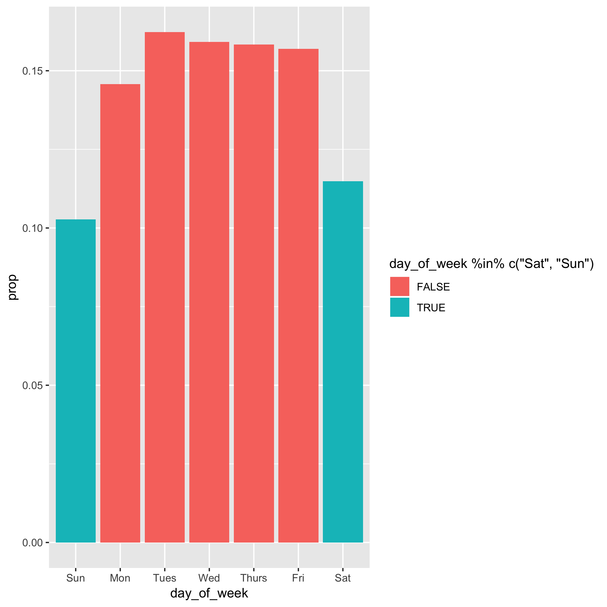

```{r setup}
if (!requireNamespace("fivethirtyeight", quietly = TRUE)) {
  install.packages("fivethirtyeight")
}
if (!requireNamespace("tidyverse", quietly = TRUE)) {
  install.packages("tidyverse")
}
library(fivethirtyeight)
library(tidyverse)
```


## Data

In the `fivethiryeight` package there are two datasets containing birth data. We will use `US_births_1994_2003`.  Note that since we have data from 1994-2003, our results may differ somewhat from the figure based on 1994-2014.

```{r}
US_births_1994_2003
```

Number of births over time.
```{r}
ggplot(US_births_1994_2003, aes(x = date, y = births)) +
  geom_line()
```
**1. There is too much fluctuation to see what is going on. Your task is to 
recreate this image using only data from 1995. In the code chunk below, complete 
the code to recreate the previous plot using only data from 1995.**

```{r}
US_births_1994_2003 %>%
  filter(year == 1995) %>%
  ggplot(mapping = aes(x = date, y = births))
```

**2. Filter observations that occur on the 5th, 12th, or 19th of each month.**

```{r}
US_births_1994_2003 %>%
  filter()
```

**3. Select only the "day_of_week" and "births" variables and filter only the observations that occur on Monday or Friday.**

```{r}
US_births_1994_2003 %>%
  select() %>% 
  filter()
```

For the remaining prompts, use the pipe function `%>%` to string together each 
step described below:

**4. Use `mutate()` to add a variable `births2`, which should be equal to one-tenth the number of births**.

**5. Use `group_by()` to group the observations by day of the week**.

**6. Use `summarize()` to estimate the mean and sum of `births2` for each day of the week**.

**7. Use `mutate()` to calculate (a) the total number of `births2` and then (b) the proportion of all `births2` for each day of the week.**

**8. Use `ggplot()` to create a bar plot depicting the proportions calculated in the previous step. Fill the non-weekend (Monday-Friday) bars in one color and the weekend bars in a different color.**


```{r}
## mutate and create new object to use in future questions
US_births_1994_2003 %>%
  mutate() %>%
  group_by() %>%
  summarize() %>%
  mutate() %>%
  ggplot(aes(x = day_of_week, y = prop)) + 
  geom_col(aes(fill = day_of_week %in% c("Sat", "Sun")))
```


The final plot should look something like this:

<p style="align:center"> </p>