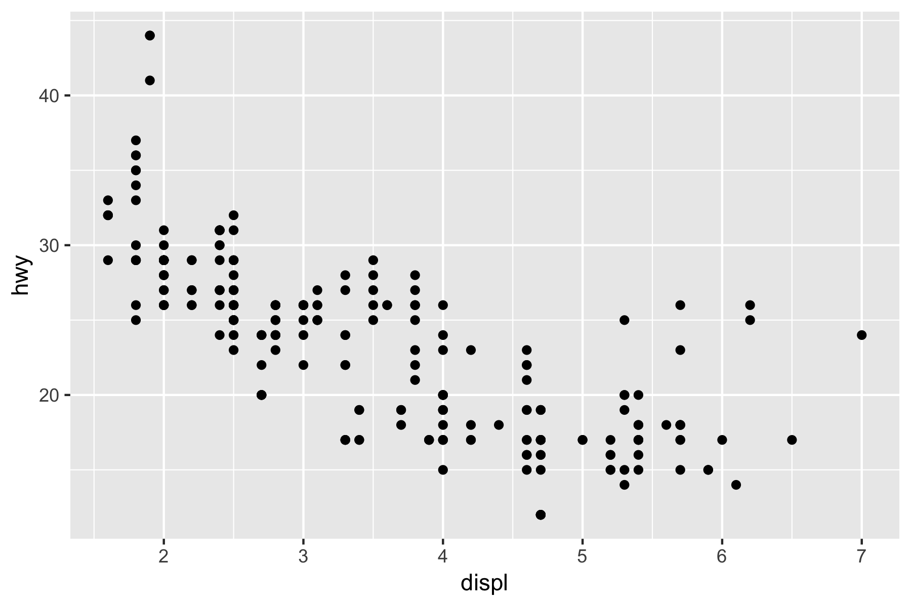
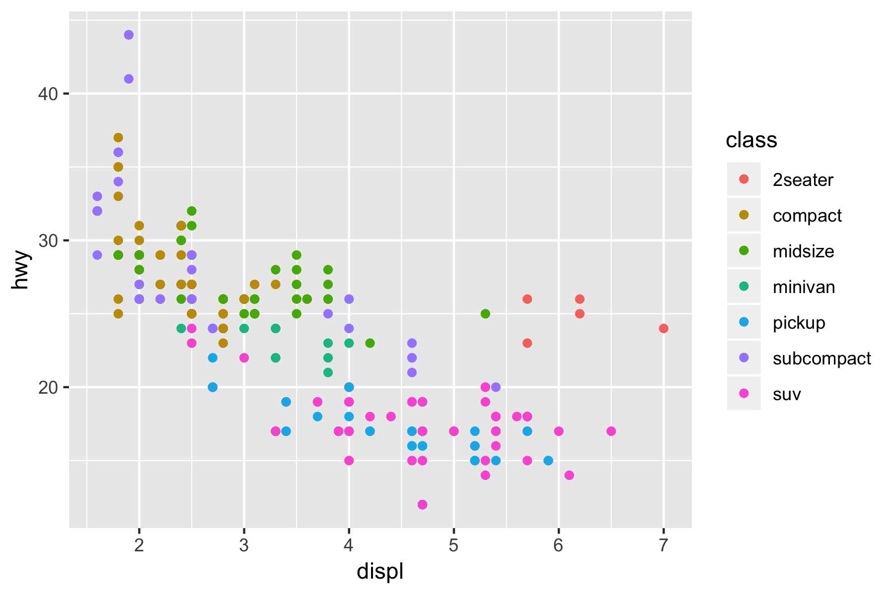
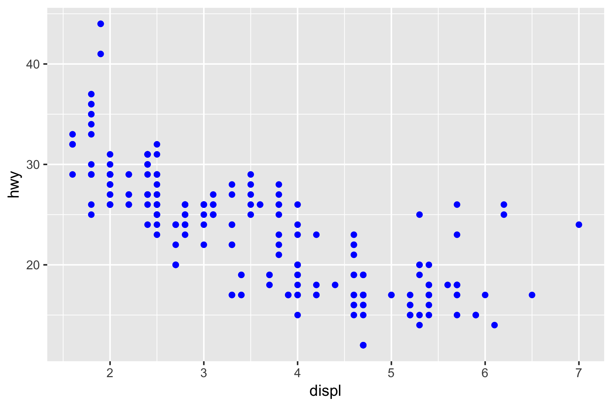
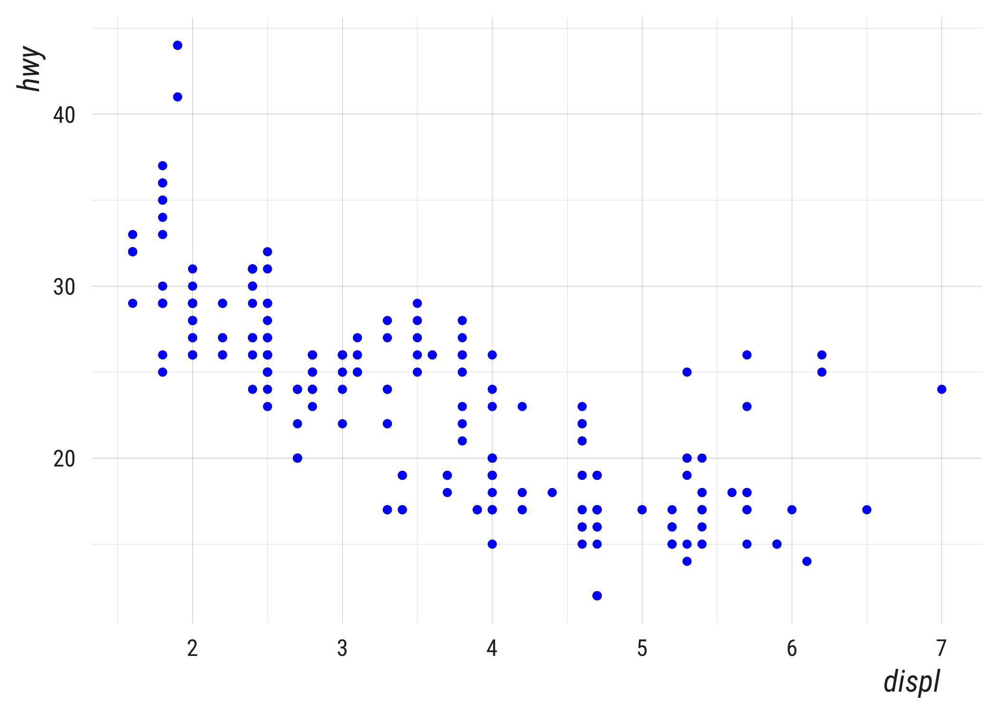

Build course directory on your computer:

``` r
source("https://raw.githubusercontent.com/mkearney/stat/master/R/build-course.R")
```

---
class: inverse, center, middle

```{r setup, include=FALSE}
knitr::opts_chunk$set(echo = TRUE, eval = TRUE, collapse = TRUE, comment = "#>")
options(htmltools.dir.version = FALSE)
htmltools::tagList(rmarkdown::html_dependency_font_awesome())

## load libraries, set ggplot2 theme, and create datatable function
library(tidyverse)
theme_set(tfse::theme_mwk(base_size = 18))
set.seed(20180911)
print <- function(x, n = NULL, align = "c", digits = 3) {
  if (is.null(n)) n <- nrow(x)
  if (nrow(x) < n) n <- nrow(x)
  cat(paste(knitr::kable(x[seq_len(n), ], format = "markdown", 
    align = align, digits = digits), collapse = "\n"))
}
```


## Agenda

---

## Agenda
+ Computing basics
+ Tidyverse
   - Visualizing
   - Transform
   - Tidy
   - Data types

---
class: inverse, center, middle

## Computing basics

---

## File/directory awareness
+ Every computer has a file/directory system
+ There's a default or home folder
   ```{r}
   ## use this to see your home folder
   normalizePath("~")
   ```
+ Files are organized like a tree
   - You can move from one branch to another
   - Moving from one folder to another is linear

---

## Bash shortcuts
+ Most popular conventions from bash/terminal found in R scripts
   - `..` to go back a folder or `../..` to go back two folders
   ``` sh
   ls ../tidyverse
   ls ../..
   ```
   - `~` as a shortcut for home, e.g., `~/R/stat`
   ``` sh
   ls ~/R/stat
   ```

---

## Don't fall asleep yet!
Why should you care?

+ Because you need to know where things are to interact with them!
+ Because you want to be able to replicate your work!

> **tl;dr**:
> Open your file browser.
> See how they're organized?
> Yeah? Good!

---

## Don't let these terms confuse you

The name or `basename()` of a file/folder:

+ **File** is **name**/location of a file
+ **Folder** is **name**/location of a file folder

The name or `dirname()` of a file/folder:

+ **Path** is name/**location** of a file
+ **Directory** is name/**location** of a file folder

---
class: inverse, center, middle

## Do unto <huge>future you</huge> </br> as you would have future you </br> do unto <huge> you</huge>.

---

## FutuRe you
Using scripts and writing clear code makes life easier

+ It's writing down point/click routines you don't have to memorize
+ Internet is full of scripts you can customize
+ With some notes and attention, future you will be very happy with current you!

---
class: inverse, center, middle

## Tidyverse

---

## Cheatsheets

+ Check out [Rstudio cheatsheets](https://www.rstudio.com/resources/cheatsheets/)

<p style="align:center">  </p>

---

## Notebooks

1. [Visualize](../tidyverse/01-visualize.Rmd)
1. [Transform)](../tidyverse/02-transform.Rmd)
1. [Tidy](../tidyverse/03-tidy.Rmd)
1. [Data types](../tidyverse/04-data-types.Rmd)

<style>
huge {font-size:1.7em;}
</style>


---
class: inverse, center, middle

## Visualize

---

## Setup

```{r, eval = FALSE}
## load tidyverse
library(tidyverse)
```


```{r, results='asis'}
## preview data
print(mpg, n = 6)
```

---

## Your Turn 1

```{r, eval = FALSE}
ggplot(data = mpg) +
  geom_point(mapping = aes(x = displ, y = hwy))
```


```{r, include = FALSE}
theme_set(theme_gray())
ggplot(data = mpg) +
  geom_point(mapping = aes(x = displ, y = hwy)) + 
  ggsave("img/05-1.png", width = 6, height = 4, units = "in")

ggplot(mpg) + geom_point(aes(x = displ, y = hwy, color = class)) + 
  ggsave("img/05-2.png", width = 6, height = 4, units = "in")

ggplot(mpg) + geom_point(aes(x = displ, y = hwy), color = "blue") + 
  ggsave("img/05-3.png", width = 6, height = 4, units = "in")

```

<p style="align:center">  </p>

---

## Breakdown

1. "Initialize" a plot with `ggplot()`
1. Add layers with `geom_` functions


**Template**:

``` r
ggplot(data = <DATA>) +
  <GEOM_FUNCTION>(mapping = aes(<MAPPINGS>))

ggplot(data = mpg) +
  geom_point(mapping = aes(x = displ, y = hwy))
```

---

## Your Turn 2

In the next chunk, add color, size, alpha, and shape aesthetics to your graph. Experiment.

+ Do different things happen when you map aesthetics to discrete and continuous variables?
+ What happens when you use more than one aesthetic?


---

Inside of `aes()`: maps an aesthetic to a variable

```{r, eval = FALSE}
ggplot(mpg) + geom_point(aes(x = displ, y = hwy, color = class))
```

<p style="align:center">  </p>

---

Outside of `aes()`: sets an aesthetic to a value

```{r, eval = FALSE}
ggplot(mpg) + geom_point(aes(x = displ, y = hwy), color = "blue")
```

<p style="align:center">  </p>

## Geoms

```{r, include = FALSE}
library(patchwork)
p1 <- ggplot(mpg, aes(displ, hwy)) + geom_point()
p2 <- ggplot(mpg, aes(displ, hwy)) + geom_smooth(method = "loess")

p1 + p2 + ggsave("img/05-04.png", width = 6, height = 4, units = "in")
```

<p style="align:center">  </p>

## Geoms

The previous plots differ by geom.

```
ggplot(data = <DATA>) +
  <GEOM_FUNCTION>(mapping = aes(<MAPPINGS>))
```


---

## Your Turn 3

With your partner, decide how to replace this scatterplot with one that draws boxplots? Use the cheatsheet. Try your best guess.

``` r
ggplot(mpg) + geom_point(aes(class, hwy))
```

```{r, include = FALSE}
p1 <- ggplot(mpg) + geom_point(aes(class, hwy))
p2 <- ggplot(mpg) + geom_boxplot(aes(class, hwy), binwidth = 2)

p1 + p2 + ggsave("img/05-05.png", width = 6, height = 4, units = "in")
```

<p style="align:center">  </p>


---

## Your Turn 4

With your partner, make the histogram of hwy below. Use the cheatsheet. Hint: do not supply a y variable.

```{r, include = FALSE}
p <- ggplot(mpg) + geom_histogram(aes(hwy))

p + ggsave("img/05-06.png", width = 6, height = 4, units = "in")
```

<p style="align:center">  </p>


---
class: inverse, center, middle

## [Transform](https://github.com/cwickham/data-science-in-tidyverse/blob/master/slides/02-Transform.pdf)

---
class: inverse, center, middle

## [Tidy](https://github.com/cwickham/data-science-in-tidyverse/blob/master/slides/03-Tidy.pdf)


---
class: inverse, center, middle

## [Data types](https://github.com/cwickham/data-science-in-tidyverse/blob/master/slides/05-Data-Types.pdf)


