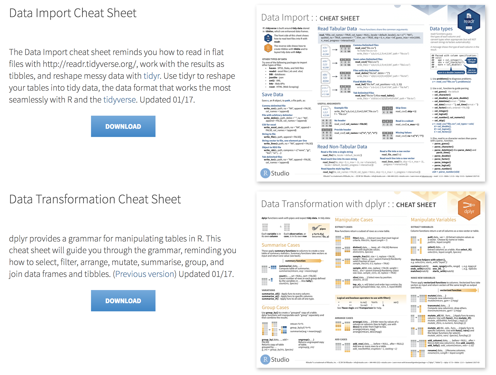

class: inverse, center, middle

```{r setup, include=FALSE}
knitr::opts_chunk$set(echo = TRUE, eval = TRUE, collapse = TRUE, comment = "#>")
options(htmltools.dir.version = FALSE)
htmltools::tagList(rmarkdown::html_dependency_font_awesome())

## load libraries, set ggplot2 theme, and create datatable function
library(tidyverse)
theme_set(tfse::theme_mwk(base_size = 18))
set.seed(20180911)
print <- function(x, n = NULL, align = "c", digits = 3) {
  if (is.null(n)) n <- nrow(x)
  if (nrow(x) < n) n <- nrow(x)
  cat(paste(knitr::kable(x[seq_len(n), ], format = "markdown", 
    align = align, digits = digits), collapse = "\n"))
}
```


## Agenda

---

## Agenda
+ Computing basics
+ Tidyverse
   - Visualizing
   - Wrangling Basics
   - Merging & Joining
   - Transforming & Cleaning

---
class: inverse, center, middle

## Computing basics

---

## File/directory awareness
+ Every computer has a file/directory system
+ There's a default or home folder
   ```{r}
   ## use this to see your home folder
   normalizePath("~")
   ```
+ Files are organized like a tree
   - You can move from one branch to another
   - Moving from one folder to another is linear

---

## Bash shortcuts
+ Most popular conventions from bash/terminal found in R scripts
   - `..` to go back a folder or `../..` to go back two folders
   ``` sh
   ls ../tidyverse
   ls ../..
   ```
   - `~` as a shortcut for home, e.g., `~/R/stat`
   ``` sh
   ls ~/R/stat
   ```

---

## Don't fall asleep yet!
Why should you care?

+ Because you need to know where things are to interact with them!
+ Because you want to be able to replicate your work!

> **tl;dr**:
> Open your file browser.
> See how they're organized?
> Yeah? Good!

---

## Don't let these terms confuse you

The name or `basename()` of a file/folder:

+ **File** is **name**/location of a file
+ **Folder** is **name**/location of a file folder

The name or `dirname()` of a file/folder:

+ **Path** is name/**location** of a file
+ **Directory** is name/**location** of a file folder

---
class: inverse, center, middle

## Do unto <huge>future you</huge> </br> as you would have future you </br> do unto <huge> you</huge>.

---

## FutuRe you
Using scripts and writing clear code makes life easier

+ It's writing down point/click routines you don't have to memorize
+ Internet is full of scripts you can customize
+ With some notes and attention, future you will be very happy with current you!

---
class: inverse, center, middle

## Tidyverse

---

## Cheatsheets

+ Check out [Rstudio cheatsheets](https://www.rstudio.com/resources/cheatsheets/)

<p style="align:center">  </p>

---

## Notebooks

1. [Visualizing](../tidyverse/01-visualize.Rmd)
1. [Wrangling (basics)](../tidyverse/02-wrangle.Rmd)
1. [Merging & Joining](../tidyverse/03-merge-and-join.Rmd)
1. [Transforming & Cleaning](../tidyverse/04-transform-and-clean.Rmd)
1. [Case Study](../tidyverse/05-case-study.Rmd)

<style>
huge {font-size:1.7em;}
</style>


<!--
## Data wrangling
+ Computing basics
+ Data frames
   - Wrangle: `select()`, `filter()`, `arrange()`, `mutate()`, `transmute()`
   - Bind: `bind_rows()`, `bind_cols()`
   - Join: `left_join()`, `full_join()`, `right_join()`
+ Text
   - Capitalize: `to_upper()`, `to_lower()`
   - RegEx: `str_replace()`, `str_remove()`, `str_extract()`, `str_detect()`
   - Split: `str_split()`
+ Numbers
   - Numbers (dollar sign, commas, etc.)
   - Dates/Times
-->