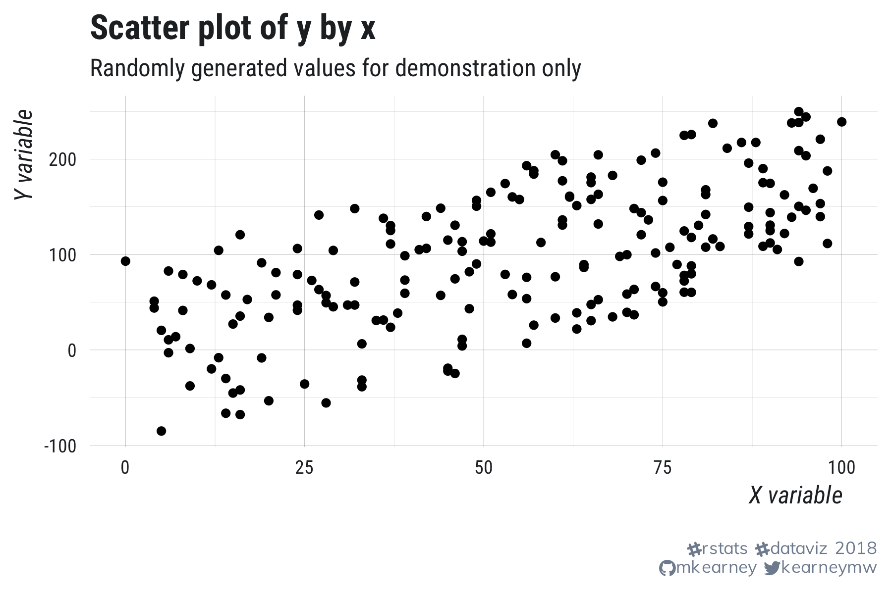
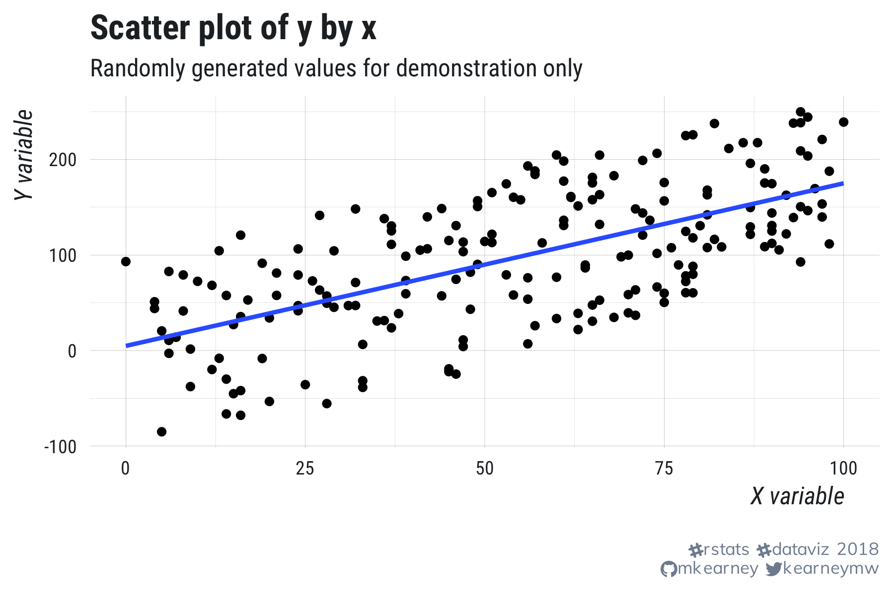
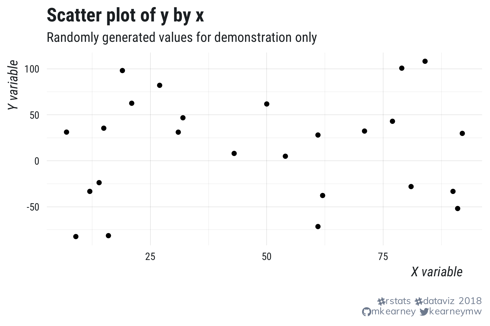
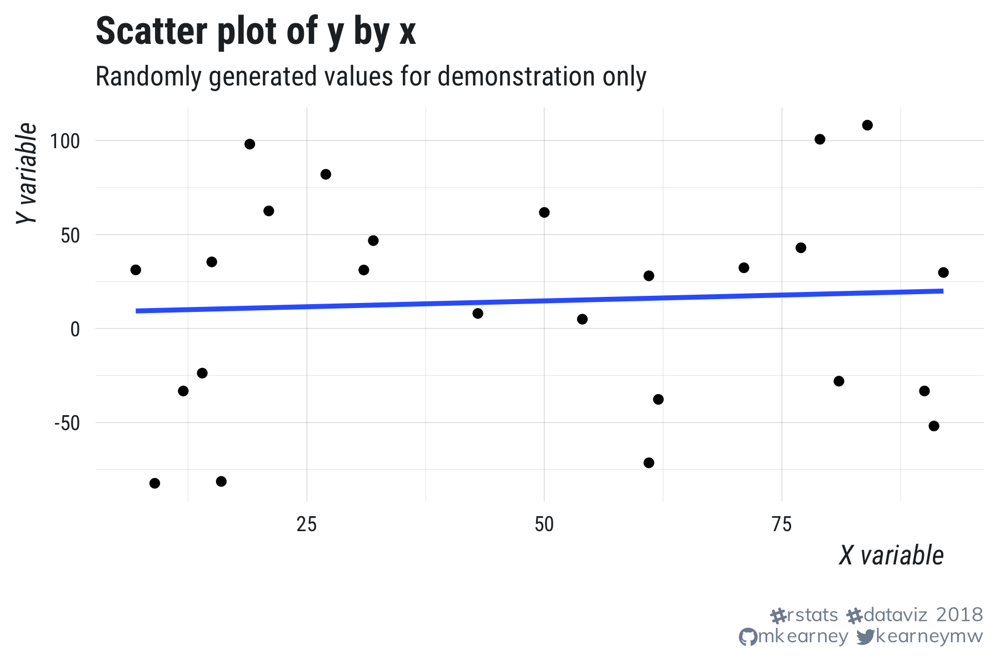
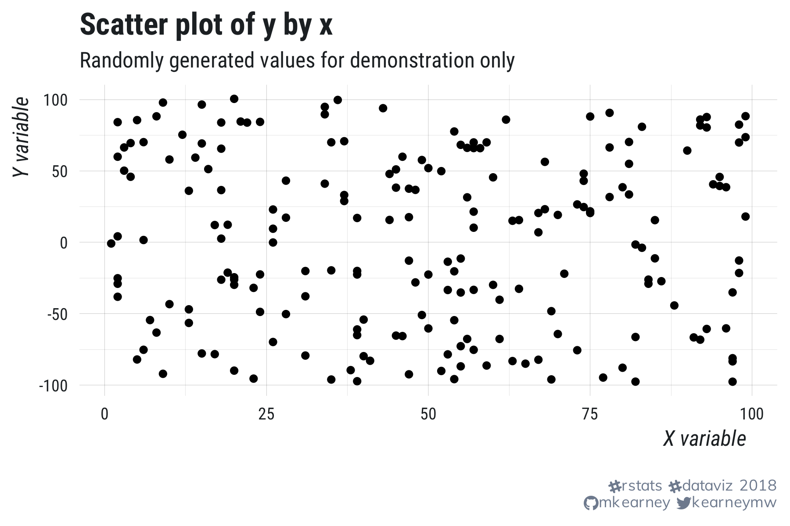
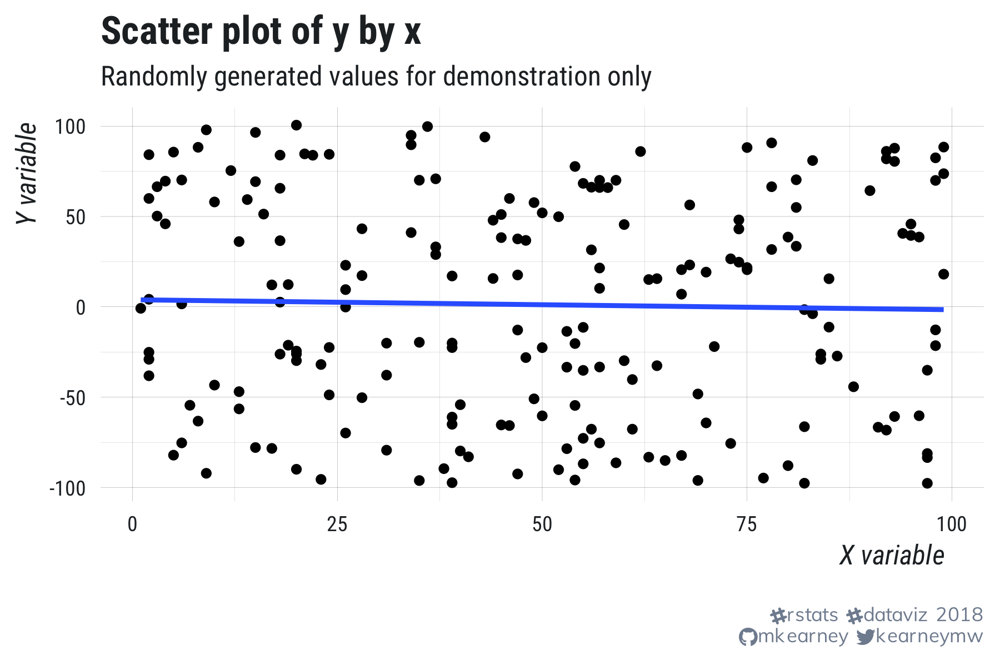
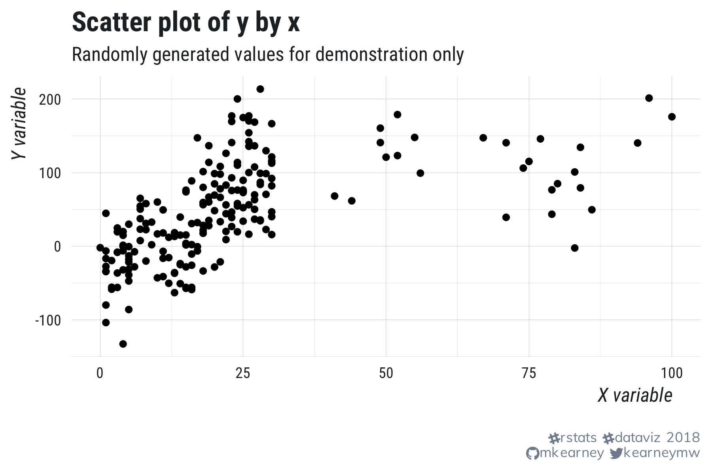
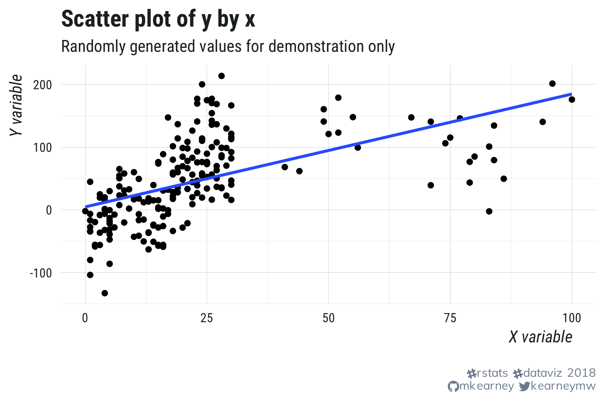

Build course directory on your computer:

``` r
source(
  "https://raw.githubusercontent.com/mkearney/stat/master/R/build-course.R"
)
```

---
class: inverse, center, middle

```{r setup, include=FALSE}
knitr::opts_chunk$set(echo = FALSE, eval = TRUE, collapse = TRUE, comment = "#>")
options(htmltools.dir.version = FALSE)
htmltools::tagList(rmarkdown::html_dependency_font_awesome())

## load libraries, set ggplot2 theme, and create datatable function
library(mwk)
theme_set(tfse::theme_mwk(base_size = 14))
set.seed(20180911)
print <- function(x, n = NULL, align = "c", digits = 3) {
  if (is.null(n)) n <- nrow(x)
  if (nrow(x) < n) n <- nrow(x)
  cat(paste(knitr::kable(x[seq_len(n), ], format = "markdown", 
    align = align, digits = digits), collapse = "\n"))
}
source("06-slides.R")
```


## Linear model - regression

---

## Key terms

**DV**: Dependent Variable:  
+ The output or thing (singular) we are predicting 
+ Synonyms: output, outcome, endogenous

**IV**: Independent Variable:
+ The inputs or things (one or more) we use to predict 
+ Synonyms: input, endogenous, predictor, covariate

---

## Line of best fit

+ Straight line that *best fits* the data
   - **Best fit**: Criterion of minimizing the *sum of squared errors*
+ Line represents **predicted** (or **fitted**) values
   - For any value of an input, we predict the outcome value will be on the line


---

## Useful functions

+ `lm()`: Creates a regression model
  - Important args: `formula` and `data`
+ `summary()`: Results of the regression
+ `anova()`: Sum of squares information
+ `confint()`: Confidence intervals
+ `plot()`: Diagnostic displays


---
class: inverse, center, middle

## Models lexicon

---

## Labelling stats/models

**The [general] linear model**: statistical method for predicting an outcome 
variable using a linear combination of inputs (predictors)

**Difference tests**
+ t-test, f-test

**Analysis of variance**
+ ANOVA, ANCOVA, MANOVA, MANCOVA

**Regression**
+ Ordinary linear squares (OLS) regression, linear regression

---

## Equation

**The [general] linear model**: statistical method for predicting an outcome 
variable using a linear combination of inputs (predictors)

+ Linear models can be represented with a formula

$$Y_{i}=A + BX_{i} + E_{i}$$

+ `X` and `Y` are observations of predictor and outcome
+ `A` is the intercept (fitted value of Y when X is zero)
+ `B` is slope (effect of `X` on `Y`) for a one-unit change in the value of `X`

---

## Example equation(s)

For a single predictor

$$Y_{credibility} = A + B * X_{experience}$$

For any number of predictors

$$Y_{credibility} = A + B_{1} * X_{experience} + B_{2} * X_{market}$$


---

## Ordinary Least Squares

+ All linear models attempt to find the **best fit** (matching observed with 
predicted values)
   - Maximize accuracy/minimize **residuals** (error)

$$Residual = y_{i} - \widehat{Y}$$

+ The most common method is **least squares**, which attempts to minimize
the distance of squared errors
   - The squared difference between observed and predicted values of the outcome variable)
+ **OLS regression** is simple, powerful, and widely used


---

## What can we regress?


<p style="align:center">  </p>


---

## Yep!

<p style="align:center">  </p>


---

## What about this?

<p style="align:center">  </p>


---

## Not precise!

<p style="align:center">  </p>


---

## And this one?

<p style="align:center">  </p>


---

## Yep!

<p style="align:center">  </p>


---

## And this one?

<p style="align:center">  </p>

---

## Prob not!

<p style="align:center">  </p>


---
class: inverse, center, middle


## Assumptions

---

## Assumptions of OLS regression
+ We don't assume much about predictors
+ We assume ***a lot*** about the outcome variables

---

## Assumptions
1. **Linear** combination of parameters (coefficients)
2. Mean of **residuals** is zero (equally distributed above and below the 
observed outcomes)
3. **Homoscedasticity** or equal variance
4. **Independence** of residuals
5. Predictor variables are at least somewhat **orthogonal**/independent
  - Tolerance: multiple correlation of predictors
  - VIF: 1 / tolerance

---

## IID
+ **Independent and identically distributed**
+ Observed scores of the outcome occur independently and are the result of the 
same underlying data generating process


---

## Model fit

+ Regression coefficients describe the size, direction, and reliability of the 
effect of one or more predictors on the expected value of the outcome variable
+ To assess how well a model fits the data overall, we need **model fit** 
statistics
   - Often conflated with **effect size**

---

## R-squared

+ For OLS regression, the most common fit statistic is $R^2$
   - Proportion of total variance explained by the model
   - Like the correlation coefficient but it can only be positive

$$R^2 = \frac{s^2_{explained}}{s^2_{total}}$$

+ Because $R^2$ can never really go down, it's often appropriate to report an 
adjusted $R^2$
   - $R^2$ estimate penalized by number of parameters

---

## Other fit indices
+ **RMSEA**: average distance of residuals from zero

$$MSE=\frac{1}{n}\sum (\widehat{Y} - y_{i})^2$$

+ **F statistic**: compares the estimated model to a simpler model (e.g., 
intercept-only model)
+ **AIC/BIC/CFI/TLI**: there are lots of variations but these ones are also 
common

---

## Formulas in R

Indicate a formula in R with the tilde `~` symbol
```{r, echo=TRUE}
f <- y ~ x
class(f)
```

Use this formula notation to specify your models

+ LHS: always the outcome
+ RHS: always the predictor(s) separated by plus signs
+ **`data`**: make sure to specify your data set

---

Formula with `cor.test()`

```{r, echo=TRUE}
cor.test(~ mpg + wt, data = mtcars)
```

Formula with `lm()`

```{r, echo=TRUE}
lm(mpg ~ wt, data = mtcars)
```

---

## Regression in R

Use the `lm()` function to specify the model.

+ First argument, `formula`, is the model specification
+ Specify data set with `data` argument

```{r, echo=TRUE}
## run model
m <- lm(mpg ~ wt + gear, data = mtcars)
```

---

Use the `summary()` function on the output from `lm()` to see the regression 
table results

```{r, echo=TRUE}
## view results
summary(m)
```

---

## broom

The broom package is useful for viewing coefficients and model fit statistics too

```{r, echo=TRUE}
## another way to view coefficients
broom::tidy(m)

## another way to view model fit
broom::glance(m)
```


---

## stargazer

The stargazer package is useful for outputing regression tables (printing to 
text in the console, html code, latex, etc.)

There are a handful of other packages that do this too. I'm honestly not sure
which one is best.

---

```{r, echo=TRUE}
stargazer::stargazer(m, type = "text")
```

---

## knitr

Or, in Rmarkdown, you can use `knitr::kable()` on a data frame


```{r, echo=TRUE}
knitr::kable(broom::tidy(m), format = "html")
```

