class: inverse, center, middle

```{r setup, include=FALSE}
knitr::opts_chunk$set(echo = TRUE, eval = TRUE, collapse = TRUE, comment = "#>")
options(htmltools.dir.version = FALSE)
htmltools::tagList(rmarkdown::html_dependency_font_awesome())

## load libraries, set ggplot2 theme, and create datatable function
library(tidyverse)
theme_set(tfse::theme_mwk(base_size = 18))
set.seed(20180911)
print <- function(x, n = NULL, align = "c", digits = 3) {
  if (is.null(n)) n <- nrow(x)
  if (nrow(x) < n) n <- nrow(x)
  cat(paste(knitr::kable(x[seq_len(n), ], format = "markdown", 
    align = align, digits = digits), collapse = "\n"))
}
#revenue <- sample(0:100, 100, replace = TRUE)
#quality_num <- runif(100, 0, 10) * (revenue * .2)
#quality_cat <- ifelse(quality_num > quantile(quality_num, .66), " HiQual", 
#  ifelse(quality_num > quantile(quality_num, .33), " MdQual", " LoQual"))
#ads_num <- as.integer(runif(100, 0, 20) * (revenue * .2))
#ads_cat <- ifelse(ads_num > median(ads_num), "YesAds ", "NoAds  ")
#news_data <- data.frame(ads_num, ads_cat, quality_num, quality_cat, revenue)
news_data <- readRDS("data/news_data.rds")
```


## Generalized linear models

---

## Agenda
+ Mediation/Moderation
   - Moderation (interactions)
   - Mediation
   - Path analysis
+ Generalized models
   - Logistic regression
+ mturk experiment
   - AP vs Twitter vs Facebook

---
class: inverse, center, middle

## Moderation

---

## Moderation

Extent to which the effect of a predictor (**X**) on an outcome (**`Y`**) **depends** on a third variable (**W**), called a **moderator**

---

## Y on X

<p style="align:center"> 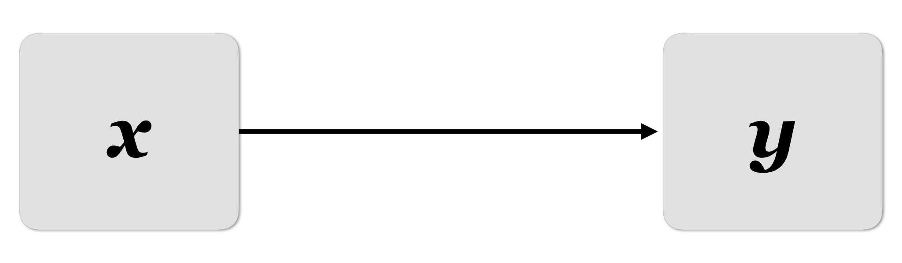 </p>

Moderation: the effect of X on Y depends on another variable

---

## Y on X *through* W

<p style="align:center"> 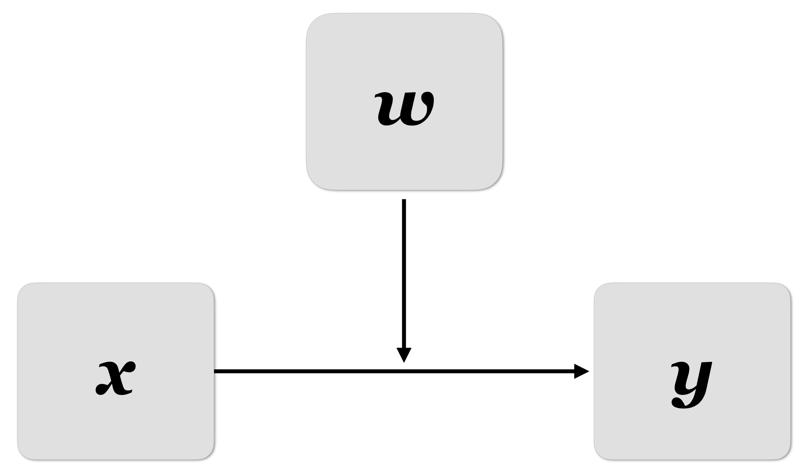 </p>

---

## Moderation

+ Same as **interaction**
+ **"Depends"** interpretations are reversible, e.g.,
   - The effect of political knowledge [on participation] depends on gender
   - The effect of gender [on participation] depends on political knowledge

---

## Calculating moderation

+ Using the linear model, we simply add an **interaction term**

``` r
lm(y ~ x + w + x * w, data = data)
```

+ For a shortcut that produces the same result, only enter the interaction

``` r
lm(y ~ x * w, data)
```


---

<p style="align:center"> 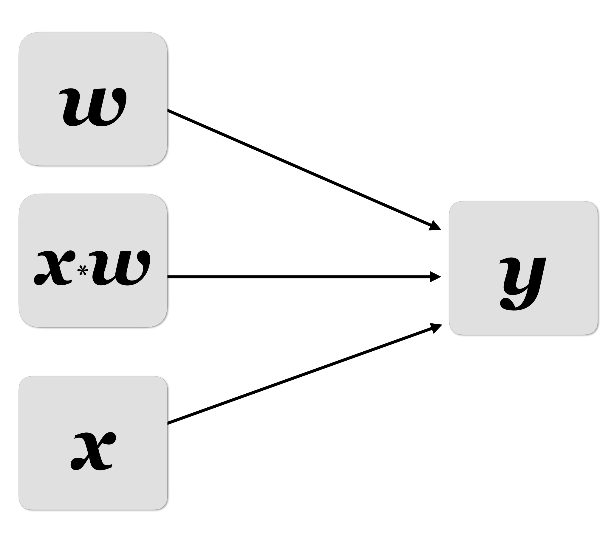 </p>

---

## Moderation

The effect of **X** on **Y** is **moderated** if its existence, size, or direction varies with (depends on) **W**

Moderation helps us understand...

+ conditions that enable, augment, suppress, or invert the effect
+ for whom/what the effect is large or small, positive or negative, present or absent, etc.
+ when the effect is large or small, positive or negative, present or absent, etc.

---

## Moderation example

Example context: studying the effect of newspaper advertisements on product revenue


<p style="align:center"> 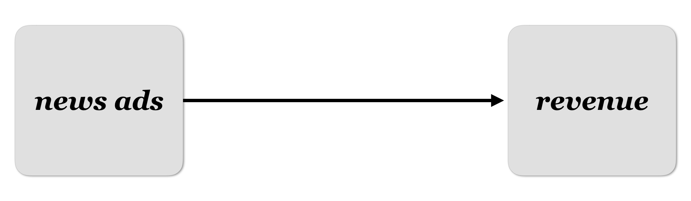 </p>


---

## Quick write (60s)

Using variables below, write two hypotheses (one num; one cat) and share with your neighbor

+ **DV/Y**: product revenue (dollars) **`revenue`**
+ **IV/X**: newspaper advertisements (count) 
   - **`ads_num`**: Number of ads
   - **`ads_cat`**: Yes ads or no ads
+ **Moderator/W**: newspaper quality 
   - **`qual_cat`**: low, medium, high
   - **`qual_num`**: value of company (dollars)


---

**Hypothesis**: 

+ The effect of **newspaper advertisements** on **product revenue** depends on 
**newspaper quality** 
   - Ads will increase revenue when in high quality newspapers
   - Ads will not increase revenue when in low quality newspapers

---

<p style="align:center"> 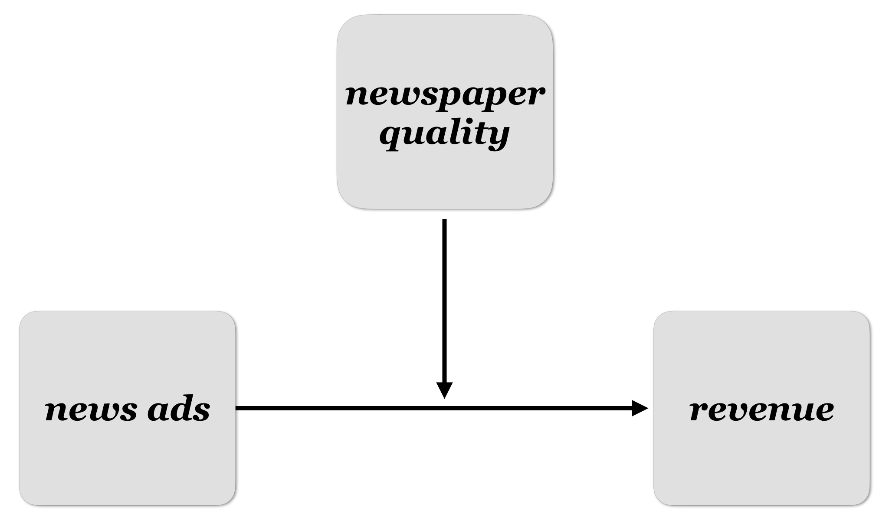 </p>

---

<p style="align:center"> 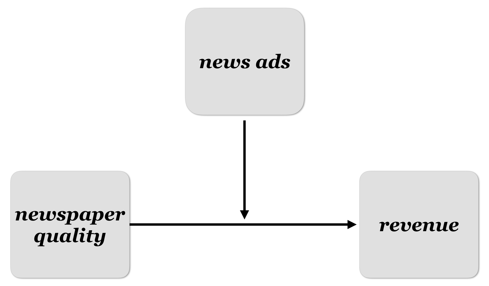 </p>


---

## Regression

```{r}
## regression model
m1 <- lm(revenue ~ quality_num * ads_num, data = news_data)
```

```{r}
summary(m1)
```


```{r, eval=FALSE, include=FALSE, echo=FALSE}
news_data2 <- news_data
news_data2$revenue <- news_data2$revenue + runif(100, -40, 40)
news_data2$quality_num <- news_data2$quality_num * runif(100, .5, 1)
ggplot(news_data2, aes(x = quality_num, y = revenue, color = ads_num > mean(ads_num))) + 
  geom_point(size = 2.5) + 
  geom_smooth(method = "lm") + 
  ggsave("img/interaction-scatter.png", width = 7, height = 6, units = "in")
```

---

## ANOVA

```{r}
## anova model
m2 <- aov(revenue ~ quality_cat * ads_cat, data = news_data)
summary(m2)
```

```{r, include=FALSE}
## view all pairwise comparisons
comparisons <- TukeyHSD(m2)
```

```{r, eval=FALSE}
## view all pairwise comparisons
(comparisons <- TukeyHSD(m2))
```


---


``` r
  Tukey multiple comparisons of means
    95% family-wise confidence level

Fit: aov(formula = revenue ~ quality_cat * ads_cat, data = news_data)

$quality_cat
                    diff      lwr      upr p adj
 LoQual- HiQual -54.3119 -63.8771 -44.7468     0
 MdQual- HiQual -27.8877 -37.4529 -18.3225     0
 MdQual- LoQual  26.4242  16.7880  36.0605     0

$ads_cat
                   diff     lwr     upr    p adj
YesAds -NoAds   13.2312 6.70409 19.7584 0.000115

$`quality_cat:ads_cat`
                                   diff     lwr     upr p adj
 LoQual:NoAds  - HiQual:NoAds   -58.222 -79.805 -36.639 0.000
 MdQual:NoAds  - HiQual:NoAds   -35.137 -57.845 -12.429 0.000
 HiQual:YesAds - HiQual:NoAds     2.476 -19.037  23.989 0.999
 LoQual:YesAds - HiQual:NoAds   -25.500 -53.109   2.109 0.087
 MdQual:YesAds - HiQual:NoAds   -15.979 -38.871   6.913 0.333
 MdQual:NoAds  - LoQual:NoAds    23.085   8.279  37.891 0.000
 HiQual:YesAds - LoQual:NoAds    60.698  47.800  73.597 0.000
 LoQual:YesAds - LoQual:NoAds    32.722  11.139  54.305 0.000
 MdQual:YesAds - LoQual:NoAds    42.243  27.156  57.330 0.000
 HiQual:YesAds - MdQual:NoAds    37.613  22.910  52.317 0.000
 LoQual:YesAds - MdQual:NoAds     9.637 -13.071  32.345 0.819
 MdQual:YesAds - MdQual:NoAds    19.158   2.501  35.815 0.015
 LoQual:YesAds - HiQual:YesAds  -27.976 -49.489  -6.463 0.004
 MdQual:YesAds - HiQual:YesAds  -18.455 -33.442  -3.469 0.007
 MdQual:YesAds - LoQual:YesAds    9.521 -13.371  32.413 0.831
```

---

```{r, eval=FALSE, echo=FALSE}
comparisons <- data.frame(
  group = row.names(comparisons$`quality_cat:ads_cat`),
  diff = comparisons$`quality_cat:ads_cat`[, 1], 
  p = comparisons$`quality_cat:ads_cat`[, 4], 
  stringsAsFactors = FALSE, 
  row.names = NULL)
comparisons %>%
  arrange(diff) %>%
  mutate(group = factor(group, levels = group)) %>%
  ggplot(aes(x = group, y = diff)) + 
  geom_col(aes(fill = p < .05)) + 
  coord_flip() + 
  ggsave("../img/tukey.png", width = 7, height = 6, units = "in")
```

<p style="align:center"> 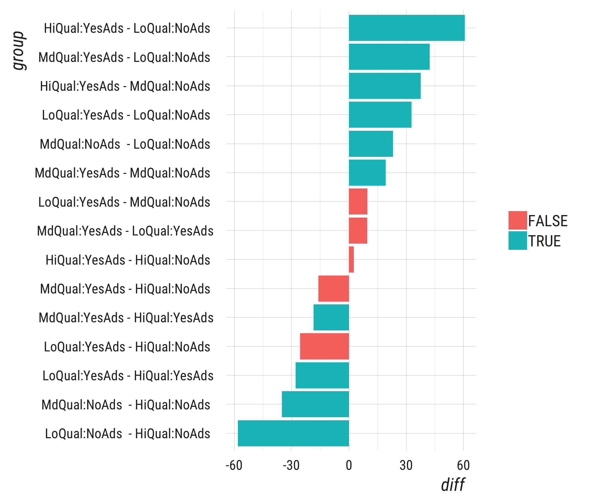 </p>

---

## Note

For the plot on the following slide...

+ lines represent whether the number of ads (associated  with each observation) is greater than the mean number of ads 

``` r
ads_num > mean(ads_num)
```

+ How do we interpret the following plot? What's the key takeaway?

---

<p style="align:center"> 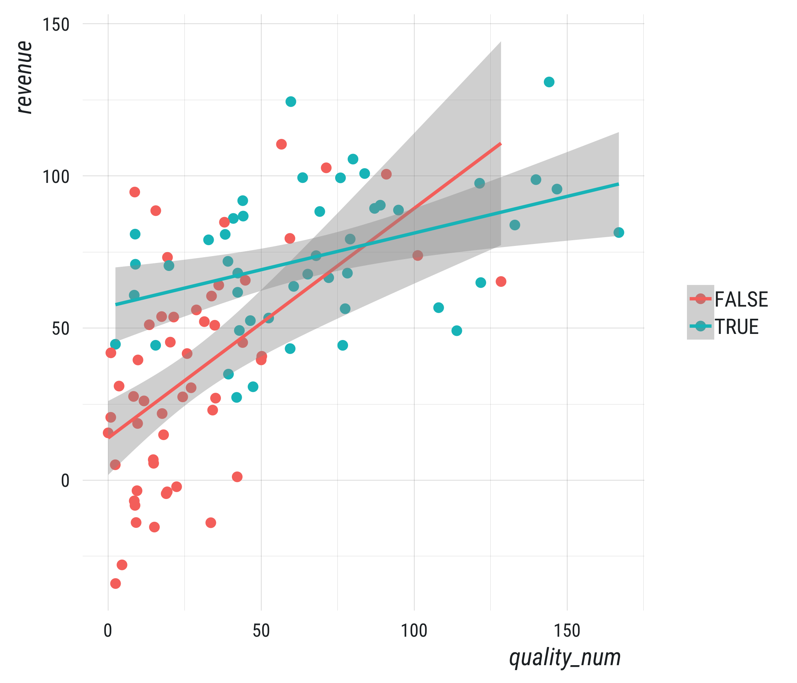 </p>


---

## Results

+ Ads **increased** revenues **when in high quality** newspapers
+ Ads had **no effect** on revenues **when in medium quality** newspapers
+ Ads **decreased** revenues **when in low quality** newspapers


---
class: inverse, center, middle

## Mediation

---

## Mediation

Mediation analysis links a presumed cause **X** to a presumed effect **Y**, at least in part, through an intermediary or **mediator** variable **M**

+ Key difference with moderation: **X** has an effect on both **M(W)** and **Y**
   - Some variables (race, age, etc.) can't be mediators

---

## Mediation

<p style="align:center"> 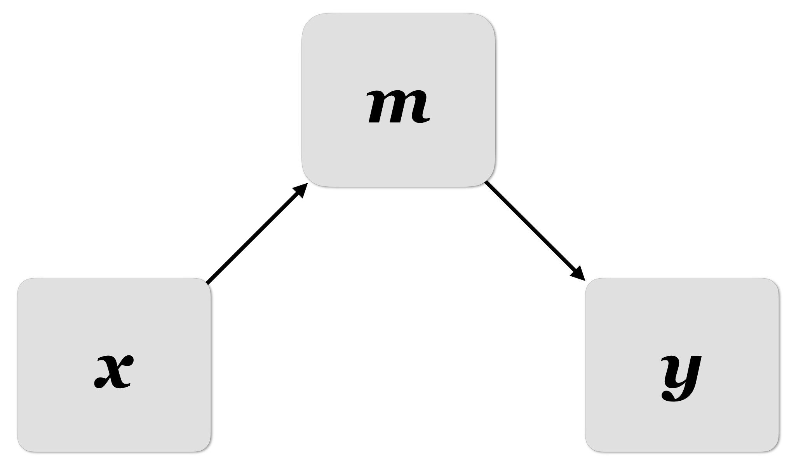 </p>

---

## Mediation

+ **X** to **M** to **Y** is a causal chain of events

+ A mediator variable can be a psychological state, a cognitive process, an 
observed behavior, an affective response, a biological change, or any other
conceivable *mechanism* variable through which **X** exerts an effect on **Y**

+ But the effect must occur causally between **X** and **Y**

---

<p style="align:center"> 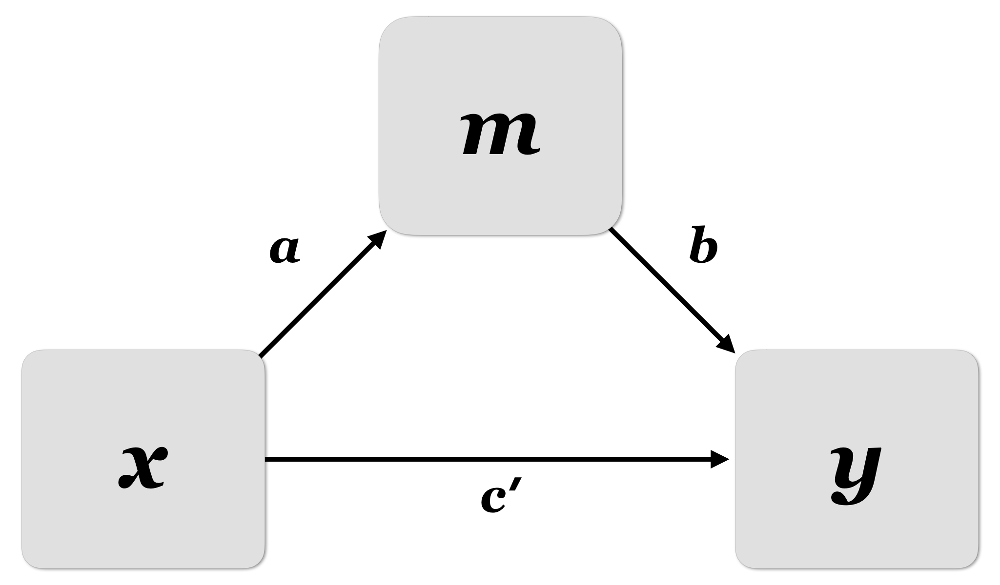 </p>

---

## Baron & Kenny

Baron & Kenny describe three steps, using Sobel's test

1. Significant relationship between x and y
2. Significant relationship between x and w (a)
3. Significant relationship between w and y (b)

> Baron & Kenny's steps are too conservative

---

<p style="align:center">  </p>

---

## Mediation

+ Evidence that **ab** is different from zero is consistent with mediation
+ Evidence that path **c** is different from zero is **not a requirement of modern mediation analysis**
+ Correlation between **X** and **Y** is neither sufficient nor necessary to claim that **X** affects **Y**
+ Test the interaction via bootstrapping and confidence intervals

---
class: inverse, center, middle

## Mediation & Moderation


---

## Mediation & Moderation

+ We can combine moderation and mediation analysis
   - "Moderated mediation" or "mediated moderation"

+ Hayes proposes "conditional process analysis"

---

## Conditional process analysis

There's a better way to talk about mediation and moderation

+ **Direct effects** describe the effect of a predictor **on** the outcome
+ **Indirect effects** describe the effect of a predictor **through** another variable [on the outcome]
+ **Conditional effects** describe **moderated** direct and indirect effects

---

## PROCESS

+ **Conditional process analysis** is modeling strategy with the goal of describing the conditional nature of the mechanism(s) by which a variable transmits its effect on another
   - testing hypotheses about such contingent effects.
+ Macros in SPSS and SAS, maybe R?


---

## Path analysis

Using simultaneously equations, it's possible to estimate a mediation model via path analysis. This
is the same framework used for strutural equation modelling

In R, the lavaan package makes path analysis fairly easy...

---

## lavaan

Does the effect of advertisements on revenue occur **through** newspaper quality?

```{r, eval=FALSE}
## load lavaan package
library(lavaan)

## specify model
model_syntax <- paste0(
  'quality_num ~ a*ads_num\n',
  'revenue ~ b*quality_num + c*ads_num\n',
  'ind := a * b\n',
  'c2 := c - ind')

## estimate model
m3 <- sem(model_syntax, data = news_data)

## print summary
summary(m3)
```

---

``` r
#> lavaan 0.6-3 ended normally after 16 iterations
#>
#>   Optimization method                           NLMINB
#>   Number of free parameters                          5
#>   Number of observations                           100
#>
#>   Estimator                                         ML
#>   Model Fit Test Statistic                       0.000
#>   Degrees of freedom                                 0
#>
#> Parameter Estimates:
#>   Information                                 Expected
#>   Information saturated (h1) model          Structured
#>   Standard Errors                             Standard
#>
#> Regressions:
#>                    Estimate  Std.Err  z-value  P(>|z|)
#>   quality_num ~                                       
#>     ads_num    (a)    0.306    0.043    7.196    0.000
#>   revenue ~                                           
#>     quality_nm (b)    0.377    0.043    8.757    0.000
#>     ads_num    (c)    0.099    0.023    4.383    0.000
#> 
#> Variances:
#>                    Estimate  Std.Err  z-value  P(>|z|)
#>    .quality_num    1431.484  202.442    7.071    0.000
#>    .revenue         265.102   37.491    7.071    0.000
#> 
#> Defined Parameters:
#>                    Estimate  Std.Err  z-value  P(>|z|)
#>     ind               0.115    0.021    5.560    0.000
#>     c2               -0.016    0.036   -0.460    0.645
```


---
class: inverse, center, middle

## Generalized models

---

## Non-normal outcomes

**OLS assumption**: residuals (errors) are normally distributed

+ What happens if the outcome is not normally distributed? 
+ What are some outcome variables that wouldn't follow a normal (bell curve) distribution?


---
class: inverse, center, middle

## Logistic regression

---

## Logistic regression

+ Residuals for dichotomous outcomes (only two levels) aren't normal

```{r, eval=FALSE}
## flip 10 coins and track whether heads or tails
cf <- factor(sample(c("heads", "tails"), 10, replace = TRUE), levels = c("heads", "tails"))

## conver to integer with tails = 1 and heads = 0, guess the mean
residuals <- as.integer(cf) - mean(as.integer(cf))

## plot residuals
ggplot(data.frame(residuals), aes(x = residuals)) + geom_bar() + 
  ggsave("img/binary-residuals.png", width = 7, height = 5, units = "in")
```

---

Coin flip residuals

<p style="align:center"> 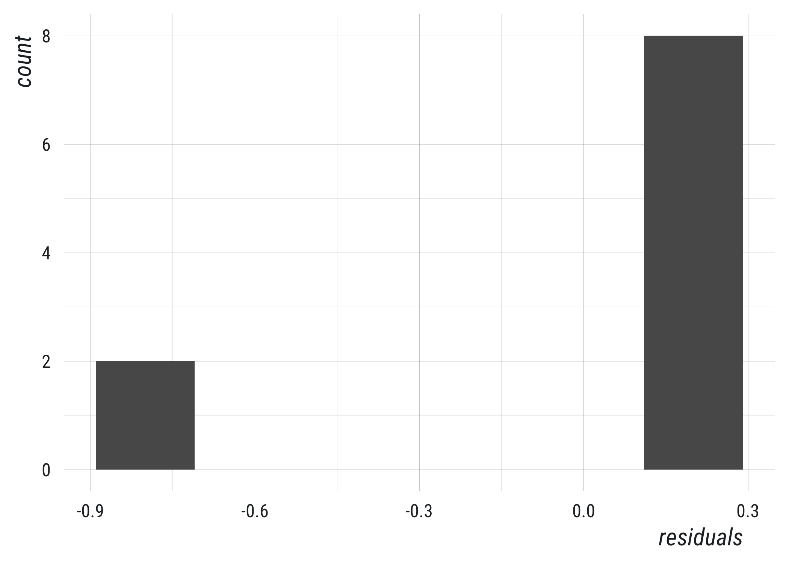 </p>


---

## Logistic regression

+ For dichotomous outcomes, it's more accurate to assume a **binomial distribution** of residuals
+ **Logistic regression**: uses maximum likelihood and the binomial probability equation to calculate coefficients
   - More theoretically sound
   - More accurate and more powerful
   - Less interpretable

---
class: inverse, center, middle

## `glm()`


---

## Generalized models

All generalized models have two important features to be aware of

- Calculations are done via **maximimum likelihood** (estimator leveraging calculus and probability theory)
   - Biased for small samples
   - Desirable asymptotic qualities
- Assumed outcome distributions can be normal or non-normal


---

## Distributions/GLMs

+ **Dichotomous**: binomial (logistic) 
   - `glm(f, data = data, family = binomial)`
+ **Count**: poisson
   - `glm(f, data = data, family = poisson)`
+ **Overdispersed count**: negative binomial
   - `glm.nb(f, data = data)`

---

## Quasi-methods

+ Sometimes data do not technically meet strict requirements of family, e.g., 
   - probabilities instead of 0/1
   - Average counts instead of raw counts
+ **Quasi.*** versions are often available and work well 
   - `glm(f, data = data, family = quasipoisson)`
   - `glm(f, data = data, family = quasibinomial)`


