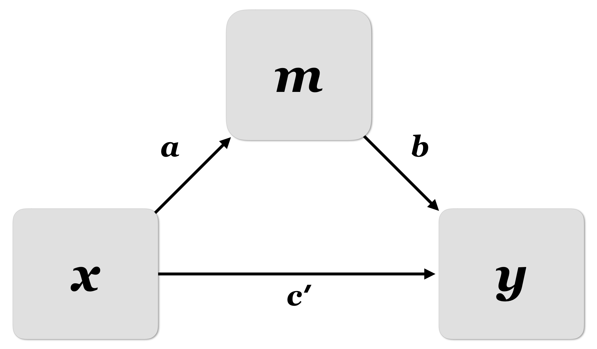

class: inverse, center, middle

```{r setup, include=FALSE}
knitr::opts_chunk$set(echo = TRUE, eval = TRUE, collapse = TRUE, comment = "#>")
options(htmltools.dir.version = FALSE)
htmltools::tagList(rmarkdown::html_dependency_font_awesome())

## load libraries, set ggplot2 theme, and create datatable function
library(tidyverse)
theme_set(tfse::theme_mwk(base_size = 18))
set.seed(20180911)
print <- function(x, n = NULL, align = "c", digits = 3) {
  if (is.null(n)) n <- nrow(x)
  if (nrow(x) < n) n <- nrow(x)
  cat(paste(knitr::kable(x[seq_len(n), ], format = "markdown", 
    align = align, digits = digits), collapse = "\n"))
}
```

## Longitudinal models


---

## Longitudinal models

+ Observations that occur at multiple points in time
+ Survey/experimental studies with at least two time-points
+ Each time point represents a unique variable
   - e.g., media exposure at $t_{1}$, media exposure at $t_{2}$
+ Repeated observations (AKA **panel** data)

---

## Longitudinal analysis

+ Mutliple different statistical approaches/frameworks
   - Path analysis
+ Goal: model data while accounting for time-related dependencies
   - Contemporaneous (same time) effects
   - Correlation with past self (stability)
+ Goal: to provide better evidence of causality or *causal direction*

---
class: inverse, center, middle

# Extending what we know...

---

## Repeated Measures (RM) ANOVA

+ It's possible to analyze change between groups across two points in time using
repeated measures ANOVA
   - It's just like ANOVA but it adds a static correlation coefficient to model the dependency between pairwise observations (e.g., the correlation between person A at time 1 and person A at time 2)

---

## ANOVA works well when…
+ Experimental stimuli are controlled and exchangeable
+ Experimental manipulations create discrete conditions
+ One has complete data

---

## Core problem with ANOVA
+ Repeated-measures pose a problem to most standard statistical procedures
+ Assumption:
   - obs. are independent and identically distributed
+ Statistical procedures are not robust to this violation
   - can lead to increased Type I. Error
   - inaccurate estimate of the effects
   - loss of statistical power

---

## Further problems
+ dealing with missing data
   - in repeated measure variable (with listwise deletion)
   - in other variables
+ many constraints
   - IV must be categorical
   - DV must be continuous
   - restrictive assumption about the variances

---

## What can multilevel models (MLM) do for you?
+ Model dependency across observations
+ Include categorical or continuous predictors at any level
+ Does not require same data structure for each person

---

## MLM versus RM ANOVA

1. MLM has less stringent assumptions
1. MLM allows Hierarchical Structure
1. MLM can handle missing data
1. MLM can also handle data in which there is variation in the exact timing of data collection
1. MLM is relatively easily extended to discrete data

---

## Complex longitudinal models
+ ANOVA also falls short when there are more than two time points
+ For example, to test for mediation, some people suggest you need at least **three** time points

---

## Mediation

+ Last time we talked about mediation models
+ Often these models are estimated using cross-sectional (single timepoint) data
   - Begins the question of sequence and ultimately causality
+ Path analysis can examine mediation across multiple time points

---

<p style="align:center">  </p>

---

<p style="align:center">  </p>

+ x = wave 1
+ m = wave 2
+ y = wave 3

---
class: inverse, center, middle

## Adv. longitudinal models

---

## Levels of Analysis

+ **Between-person** (BP) variation
   - **INTER**-individual differences - **time-invariant**
   - All longitudinal studies that begin as cross-sectional studies have this
+ **Within-person** (WP) variation
   - **INTRA**-individual differences - **time-varying**
   - Only longitudinal studies can provide this type of information

---

## Longitudinal analysis

+ Longitudinal studies allow examination of both between and within- relationships simultaneously (and their interactions)
   - Any variable measured over time usually has both BP and WP variation
   - BP = more/less than other people; WP = more/less than one's average
+ I use "person" here, but "between" units can be anyhting that is measured repeatedly (like animals, schools, countries, newspapers, ...)

---

## Longitudinal data continuum

+ **Within-person (WP) change**: expect systematic effect(s) of time

+ **Within-person (WP) fluctuation**: No expected effects of time


---

## Longitudinal data continuum

+ **Within-person (WP) change**: expect systematic effect(s) of time
   - Magnitude or direction of change can be different across individuals
   - e.g., "(Latent) growth curve models" -> **time is meaningfully sampled**

+ **Within-person (WP) fluctuation**: No expected effects of time
   - OUtcome just varies/fluctuates over time (e.g., emotion, mood, stress)
   - **Time is just a way to get lots of data per person**
   - Need to consider reactivity, day of the week, circadian/schedule effets


---

## Longitudinal data continuum

+ **Within-person (WP) fluctuation**: No expected effects of time
   - OUtcome just varies/fluctuates over time (e.g., emotion, mood, stress)
   - **Time is just a way to get lots of data per person**
   - Need to consider reactivity, day of the week, circadian/schedule effets

---

## Characterizing longitudinal data

+ What should **time** be?
+ Does time vary **within persons (WP)** AND **between persons (BP)**?
+ Is time *balanced* or *unbalanced*?

---

## Characterizing longitudinal data

+ What should **time** be?
   - **WP change**: e.g., time in study, age, grade, time to/from event
   - **WP fluctuation**: e.g., time of day, day of week, day in study

---

## Characterizing longitudinal data

+ Does time vary **within persons (WP)** AND **between persons (BP)**?
   - If people differ in time at the study beginning (e.g., accelerated designs),
   the model needs to **differentiate BP from WP time effects**
   - If there is more than one kind of WP "time" (e.g., occasions within days), 
   the model needs to **differentiate levels of WP time effects**

---

## Characterizing longitudinal data

+ Is time *balanced* or *unbalanced*?
   - **Balanced = shared** measurement schedule (not necessarily equal interval)
   - Although some people may miss occasions, making their data "incomplete"
   - **Unbalanced** = peopl ehave different time values possible
   - By definition, observations are "incomplete" across persons

---

## Two sides of *any* model

+ **Model for the means**
+ **Model for the variance**


---

## Two sides of *any* model

**Model for the means**

+ AKA **fixed effects**, structural part of model
+ What you are used to caring about for testing hypotheses
+ How the expected outcome for a given observation varies as a function of 
  values on known predictor variables.


---

## Two sides of *any* model

**Model for the variance**

+ AKA **random effects and residuals**, stochastic part of model
+ What you *were* used to **making assumptions about** instead
+ How **residuals are distributed and related** across sampling dimensions (persons, occasions) -> these relationships are known as "dependency" and **this is the primary way that longitudinal models differ from general linear models** (e.g., regression)


---

## Nested data
+ Data are **nested** if they vary by subgroup and by observation
   - Observations nested by sub-group
   - Variation occurs within sub-group
+ Multilevel modeling explains different piles of variance
   - **Between** cases (differences between individuals/groups)
   - **Within** cases (change within individuals/groups)

---

## Example

+ Student test scores nested in classroom

| Teacher | Student | Score |
|---------|---------|-------|
| Gorf    | Rory    | 85    |
| Gorf    | Blake   | 91    |
| Gorf    | Taylor  | 82    |
| Jewls   | Avery   | 75    |
| Jewls   | Amari   | 80    |
| Jewls   | Zion    | 89    |

---
class: inverse, center, middle

## Latent models

---

## Latent variables

Measurement via survey and/or self-report suffers from measurement error

Ways to control for measurement error

1. Eliminate measurement error in our instruments
1. Statistically disentangle measurement error (requires multiple items)

---

## Validity vs reliability

+ **Validity**: accuracy

+ **Reliability**: consistency

---

## Latent variables models

+ Latent variable models use correlations between indicators to dillineate measurement error from true latent values

---

## CFA

+ **Confirmatory Factor Analysis** refers to the analysis of mapping latent variables to observed indicators
   - Observed indicators predict latent variables (regression)
   - One or more latent variables are unrelated (correlation)


---

## SEM

+ **Structural equation modeling** refers to the analysis of regression paths in latent variable models
   - Confirmatory factor analysis
   - Path analysis (structural regression)


---
class: inverse, center, middle

# Homework assignment

---

## Homework assignment

+ **Task**: find three peer-reviewed articles published in media/journalism/communication since the year 2010 that (a) use either multilevel modeling, latent variables (latent change/growth, structural equation), or time-series and (b) fall somewhere related to your area of interest
+ **Submit**: Upload the PDFs to Canvas
+ **Due**: 3:30pm next week
